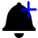

#  Advanced GitHub Notifier

    
    

A Firefox extension, that not only shows a count of notifications, but also
shows notification popups and has a popup that gives direct access to the
notifications.

## Installation
A stable release version is availabe here:

To run the in-development version from this repository, you either need to use
about:debugging or the `web-ext` tool. Further the API credentials stored in `config.js` are not
included in this repo.

## Translation
The strings for this extension can be translated on [Transifex](https://www.transifex.com/freaktechnik/advanced-github-notifier/).

## License
This extension is licensed under the [MPL-2.0](LICENSE), the octocat and octicons
are licensed under the [MIT license](images/LICENSE) according to their source.

This product is not developed or run by GitHub. It is a hobbyist project that
uses the official GitHub API to display information about the notifications
of a user on the GitHub platform. GitHub and the associated imagery are subject
to copyright and trademarks of GitHub, Inc.

## Contributors

Thanks goes to these wonderful people ([emoji key](https://github.com/kentcdodds/all-contributors#emoji-key)):

<!-- ALL-CONTRIBUTORS-LIST:START - Do not remove or modify this section -->
<!-- prettier-ignore -->
| [ <b>Martin Giger</b>](https://humanoids.be) [💻](https://github.com/freaktechnik/advanced-github-notifier/commits?author=freaktechnik "Code") [🌍](#translation-freaktechnik "Translation") [⚠️](https://github.com/freaktechnik/advanced-github-notifier/commits?author=freaktechnik "Tests") [📖](https://github.com/freaktechnik/advanced-github-notifier/commits?author=freaktechnik "Documentation") | [ <b>tooom</b>](https://github.com/Tooom) [📖](https://github.com/freaktechnik/advanced-github-notifier/commits?author=Tooom "Documentation") [🐛](https://github.com/freaktechnik/advanced-github-notifier/issues?q=author%3ATooom "Bug reports") [🤔](#ideas-Tooom "Ideas, Planning, & Feedback") | [ <b>Saran Tanpituckpong</b>](https://www.google.com/+SaranTanpituckpong) [💻](https://github.com/freaktechnik/advanced-github-notifier/commits?author=gluons "Code") [🐛](https://github.com/freaktechnik/advanced-github-notifier/issues?q=author%3Agluons "Bug reports") | [ <b>Eduardo Bellido Bellido</b>](https://edubxb.net) [💻](https://github.com/freaktechnik/advanced-github-notifier/commits?author=edubxb "Code") | [ <b>Daniele Scasciafratte</b>](https://daniele.tech) [🐛](https://github.com/freaktechnik/advanced-github-notifier/issues?q=author%3AMte90 "Bug reports") [🌍](#translation-Mte90 "Translation") [🤔](#ideas-Mte90 "Ideas, Planning, & Feedback") | [ <b>acid-crash</b>](https://github.com/Acid-Crash) [🐛](https://github.com/freaktechnik/advanced-github-notifier/issues?q=author%3AAcid-Crash "Bug reports") [⚠️](https://github.com/freaktechnik/advanced-github-notifier/commits?author=Acid-Crash "Tests") | [ <b>Sid Kapur</b>](http://sid-kap.github.io) [🐛](https://github.com/freaktechnik/advanced-github-notifier/issues?q=author%3Asid-kap "Bug reports") |
| :---: | :---: | :---: | :---: | :---: | :---: | :---: |
| [ <b>Josh Black</b>](http://raskchanky.com) [🤔](#ideas-raskchanky "Ideas, Planning, & Feedback") | [ <b>keith94</b>](https://github.com/Keith94) [🤔](#ideas-Keith94 "Ideas, Planning, & Feedback") | [ <b>Sergio</b>](https://github.com/sergioc) [🐛](https://github.com/freaktechnik/advanced-github-notifier/issues?q=author%3Asergioc "Bug reports") [🤔](#ideas-sergioc "Ideas, Planning, & Feedback") [⚠️](https://github.com/freaktechnik/advanced-github-notifier/commits?author=sergioc "Tests") |
<!-- ALL-CONTRIBUTORS-LIST:END -->

This project follows the [all-contributors](https://github.com/kentcdodds/all-contributors) specification. Contributions of any kind welcome!